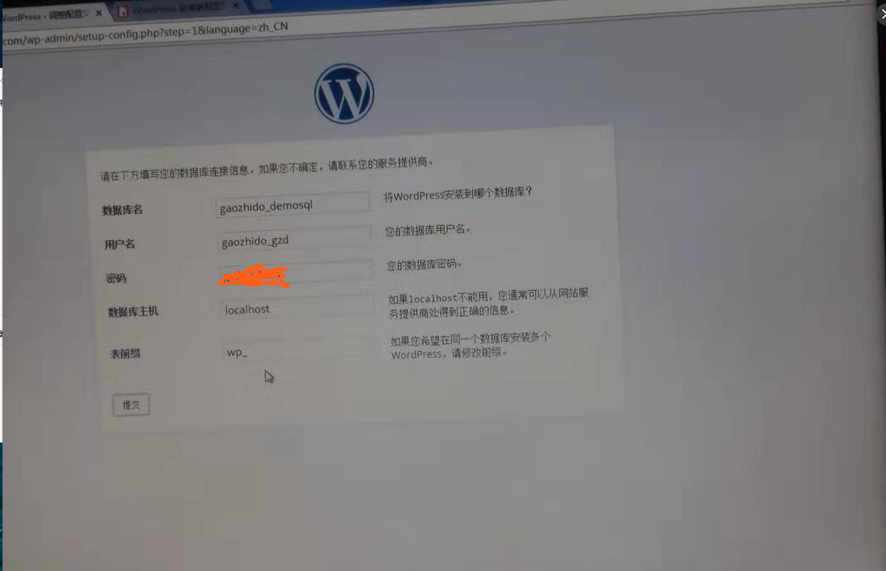

title: 搭建博客系统
speaker: dongdong
plugins:
    - echarts

<slide class="bg-black-blue aligncenter" image="https://source.unsplash.com/C1HhAQrbykQ/ .dark">

# 搭建博客系统 {.text-landing.text-shadow}

By ChuangLan {.text-intro}

<!-- [:fa-github: Github](https://github.com/ksky521/nodeppt){.button.ghost} -->


<slide :class="size-50 aligncenter">

### 方法有很多
---

1. ### **github Issuses**{.heartBeat}
2. ### **github Hexo**{.swing}
3. ### **PHP wordprass**{.slideInUp}
4. ### **...**{.flipInX}
{.text-cols.build}


<slide :class="size-50">

## 今天干啥呢?


<slide :class="size-50 aligncenter">
## 准备操作！！
---

1. ### **github**{.heartBeat}
2. ### **ｊａｖａ**{.swing}
{.text-cols.build}


<slide :class="size-50">

# [github Issuses](https://github.com/ggzzddd/Pages/issues/1)

<slide :class="size-50 aligncenter">

# github Hexo 

<slide :class="size-50" >

# 本地启动

```
npm install hexo-cli -g

npm install hexo-deployer-git --save

mkdir hexo
cd hexo
hexo init
hexo generate
hexo server (s) //本地启动

```

<slide :class="size-50 " >

```
新建一个仓库 （.github.io） 结尾
echo "# ggzzddd.github.io" >> README.md　　　//创建一个readme文件，并写入 # ggzzddd.github.io
git init
git add README.md
git commit -m "first commit"
git remote add origin git@github.com:ggzzddd/ggzzddd.github.io.git
git push -u origin master

//上传前需改 自己的仓库地址
_config.yml 

deploy:
    type: git
    repository: git@github.com:ggzzddd/ggzzddd.github.io.git  
    branch: master

            
安装Git部署插件，输入命令：      
npm install hexo-deployer-git --save

hexo clean 
hexo g 
hexo d

如果遇到问题就去搜一下吧。。。。

```

<slide :class="size-50 aligncenter" >

# [看下效果](https://ggzzddd.github.io/ggzzdd.github.io/)

<slide :class="size-50 aligncenter" >
	
# PHP wordprass




<slide :class="size-50" >

# java搭建

```
1. 搭建
2. 运行
3. 编辑
4. 发布

搜索是可以解决大部分的问题的。
```
<slide :class="size-50 aligncenter" >

# 开始

* [搜索](https://github.com/ruibaby/halo)
* 下载运行
* [继续搜索](https://halo-doc.ryanc.cc/)
* [继续搜索 继续搜索](https://ryanc.cc/archives/how-to-use-h2-database)

<slide :class="size-50 aligncenter" >
## docker

```
docker 启动停止

sudo docker start 0e5ff

sudo docker stop 0e5ff

```
[https://yeasy.gitbooks.io/docker_practice/content/](https://yeasy.gitbooks.io/docker_practice/content/)

[https://letong.gitbooks.io/docker/content/](https://letong.gitbooks.io/docker/content/)

<slide :class="size-50 aligncenter" >

# 花钱的时候到了

<slide :class="size-50" >

# 都要买什么呢！！！
---

1. **购买阿里云服务器 我选择了centos 7 的系统**{.heartBeat}
2. **购买域名，.top 几块钱一年  实名认证 备案**{.swing}
{.text-cols.build}

<slide :class="size-50 aligncenter" >

# 连接服务器

```
ssh root@公网ip
密码

```
<slide :class="size-50 aligncenter" >
## 如果还不懂，就在去看这两个吧

:::shadowbox

## [halo](https://github.com/ruibaby/halo)
github地址

---

## [视频教程](https://www.bilibili.com/video/av35788047)

如果安装时使用80端口就不需要代理了，直接解析域名就OK了

:::

<slide :class="size-50 aligncenter" >

# [成功后是什么样子呢!](http://gaozhidong.top)

